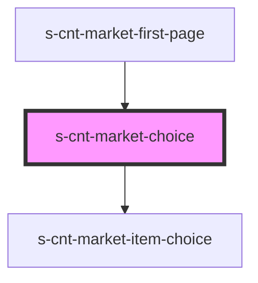

# s-cnt-market-choice

<!-- Auto Generated Below -->

## Properties

| Property          | Attribute           | Description                  | Type                      | Default     |
| ----------------- | ------------------- | ---------------------------- | ------------------------- | ----------- |
| `choiceTitleText` | `choice-title-text` | Данные для заголовка         | `string`                  | `undefined` |
| `forChoice`       | --                  | Данные для компонента Choice | `MarketChoiceInterface[]` | `[]`        |

## Dependencies

### Used by

 - [s-cnt-market-first-page](../../..)

### Depends on

- [s-cnt-market-item-choice](./res/view/s-cnt-market-item-choice)

### Graph

----------------------------------------------

*Built with [StencilJS](https://stenciljs.com/)*
