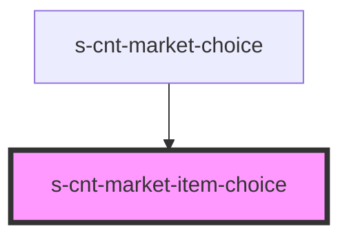

# s-cnt-market-item-choice

<!-- Auto Generated Below -->

## Properties

| Property        | Attribute | Description                      | Type                        | Default     |
| --------------- | --------- | -------------------------------- | --------------------------- | ----------- |
| `forChoice`     | --        | Данные для компонента Choice     | `MarketChoiceInterface`     | `undefined` |
| `forSpecialist` | --        | Данные для компонента Specialist | `MarketSpecialistInterface` | `undefined` |

## Dependencies

### Used by

 - [s-cnt-market-choice](../../..)

### Graph

----------------------------------------------

*Built with [StencilJS](https://stenciljs.com/)*
