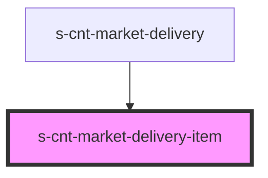

# s-cnt-market-delivery-item

<!-- Auto Generated Below -->

## Properties

| Property   | Attribute | Description    | Type                    | Default     |
| ---------- | --------- | -------------- | ----------------------- | ----------- |
| `delivery` | --        | Список городов | `MarketCitiesInterface` | `undefined` |

## Dependencies

### Used by

 - [s-cnt-market-delivery](../..)

### Graph

----------------------------------------------

*Built with [StencilJS](https://stenciljs.com/)*
