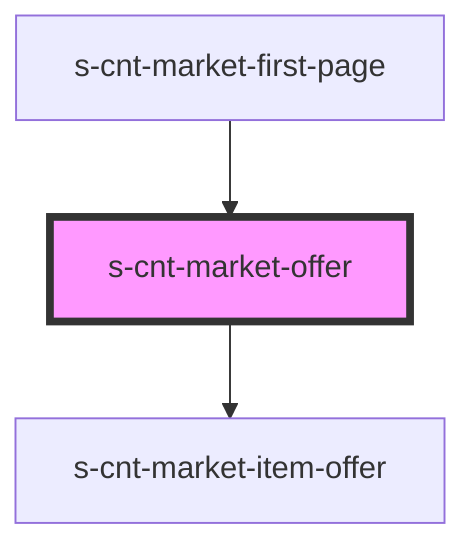

# s-cnt-market-offer

<!-- Auto Generated Below -->

## Properties

| Property         | Attribute          | Description                 | Type                     | Default     |
| ---------------- | ------------------ | --------------------------- | ------------------------ | ----------- |
| `forOffer`       | --                 | Данные для компонента Offer | `MarketOfferInterface[]` | `[]`        |
| `offerTitleText` | `offer-title-text` | Данные для заголовка        | `string`                 | `undefined` |

## Dependencies

### Used by

 - [s-cnt-market-first-page](../../..)

### Depends on

- [s-cnt-market-item-offer](./res/view/s-cnt-market-item-offer)

### Graph

----------------------------------------------

*Built with [StencilJS](https://stenciljs.com/)*
