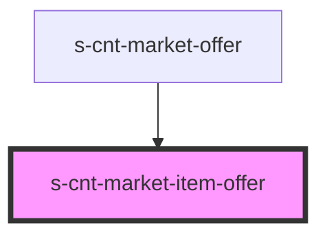

# s-cnt-market-item-offer

<!-- Auto Generated Below -->

## Properties

| Property   | Attribute | Description                      | Type                   | Default     |
| ---------- | --------- | -------------------------------- | ---------------------- | ----------- |
| `forOffer` | --        | Данные для компонента Item Offer | `MarketOfferInterface` | `undefined` |

## Dependencies

### Used by

 - [s-cnt-market-offer](../../..)

### Graph

----------------------------------------------

*Built with [StencilJS](https://stenciljs.com/)*
