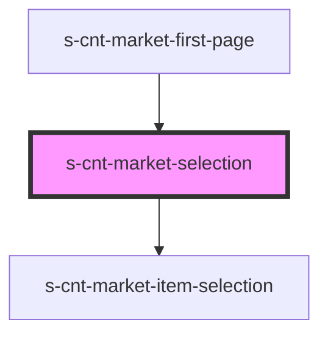

# s-cnt-market-selection

<!-- Auto Generated Below -->

## Properties

| Property        | Attribute         | Description                         | Type                         | Default     |
| --------------- | ----------------- | ----------------------------------- | ---------------------------- | ----------- |
| `forSelection`  | --                | Данные для карточек магазинов       | `MarketSelectionInterface[]` | `[]`        |
| `homePageImage` | `home-page-image` | Данные для главной картинки         | `string`                     | `undefined` |
| `homeSubText`   | `home-sub-text`   | Данные для подзаголовка на картинке | `string`                     | `undefined` |
| `homeText`      | `home-text`       | Данные для заголовка на картинке    | `string`                     | `undefined` |

## Dependencies

### Used by

 - [s-cnt-market-first-page](../../..)

### Depends on

- [s-cnt-market-item-selection](./res/view/s-cnt-market-item-selection)

### Graph

----------------------------------------------

*Built with [StencilJS](https://stenciljs.com/)*
