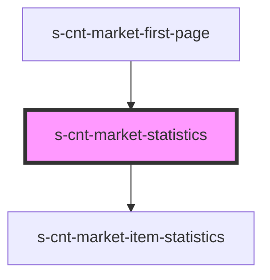

# s-cnt-market-statistics

<!-- Auto Generated Below -->

## Properties

| Property        | Attribute | Description                      | Type                          | Default |
| --------------- | --------- | -------------------------------- | ----------------------------- | ------- |
| `forStatistics` | --        | Данные для компонента Statistics | `MarketStatisticsInterface[]` | `[]`    |

## Dependencies

### Used by

 - [s-cnt-market-first-page](../../..)

### Depends on

- [s-cnt-market-item-statistics](./res/view/s-cnt-market-item-statistics)

### Graph

----------------------------------------------

*Built with [StencilJS](https://stenciljs.com/)*
