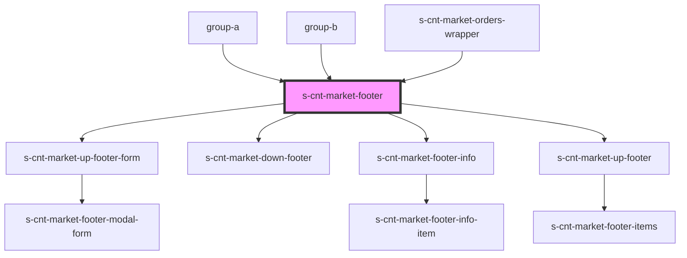

# s-cnt-market-footer

<!-- Auto Generated Below -->

## Properties

| Property     | Attribute | Description             | Type                  | Default     |
| ------------ | --------- | ----------------------- | --------------------- | ----------- |
| `footerData` | --        | Данные для всего футера | `footerDataInterface` | `undefined` |

## Dependencies

### Used by

 - [group-a](../../..)
 - [group-b](../../../../group-b)
 - [s-cnt-market-orders-wrapper](../../../../shared/s-cnt-market-orders-wrapper)

### Depends on

- [s-cnt-market-up-footer-form](./res/view/s-cnt-market-up-footer/res/view/s-cnt-market-up-footer-form)
- [s-cnt-market-down-footer](./res/view/s-cnt-market-down-footer)
- [s-cnt-market-footer-info](./res/view/s-cnt-market-footer-info)
- [s-cnt-market-up-footer](./res/view/s-cnt-market-up-footer)

### Graph

----------------------------------------------

*Built with [StencilJS](https://stenciljs.com/)*
