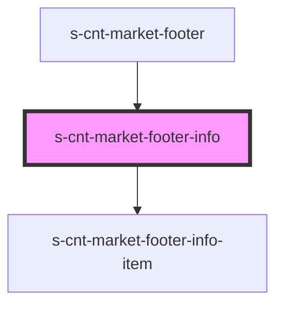

# s-cnt-market-footer-info

<!-- Auto Generated Below -->

## Properties

| Property              | Attribute | Description              | Type                           | Default     |
| --------------------- | --------- | ------------------------ | ------------------------------ | ----------- |
| `footerLinksPolitics` | --        | Данные для вывода в блок | `footerLinksPoliticsInterface` | `undefined` |

## Dependencies

### Used by

 - [s-cnt-market-footer](../../..)

### Depends on

- [s-cnt-market-footer-info-item](./res/view/s-cnt-market-footer-info-item)

### Graph

----------------------------------------------

*Built with [StencilJS](https://stenciljs.com/)*
