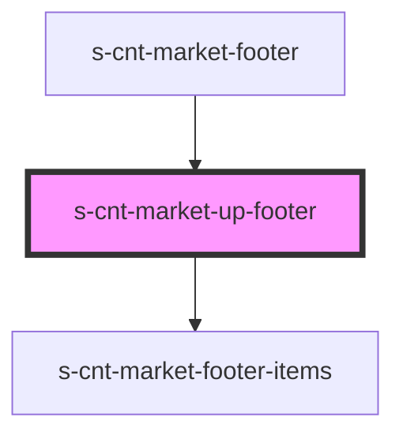

# s-cnt-market-up-footer

<!-- Auto Generated Below -->

## Properties

| Property     | Attribute | Description                         | Type                  | Default     |
| ------------ | --------- | ----------------------------------- | --------------------- | ----------- |
| `footerMenu` | --        | Данные для элементов меню в подвале | `footerMenuInterface` | `undefined` |

## Dependencies

### Used by

 - [s-cnt-market-footer](../../..)

### Depends on

- [s-cnt-market-footer-items](./res/view/s-cnt-market-footer-items)

### Graph

----------------------------------------------

*Built with [StencilJS](https://stenciljs.com/)*
