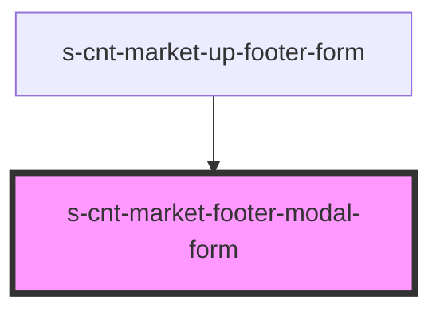

# s-cnt-market-footer-modal-form

<!-- Auto Generated Below -->

## Properties

| Property        | Attribute         | Description     | Type      | Default     |
| --------------- | ----------------- | --------------- | --------- | ----------- |
| `showModalForm` | `show-modal-form` | show modal form | `boolean` | `undefined` |

## Events

| Event                   | Description | Type                |
| ----------------------- | ----------- | ------------------- |
| `clickOnCloseModalForm` |             | `CustomEvent<void>` |

## Dependencies

### Used by

 - [s-cnt-market-up-footer-form](../../..)

### Graph

----------------------------------------------

*Built with [StencilJS](https://stenciljs.com/)*
