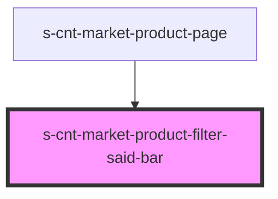

# s-cnt-market-product-filter-said-bar

<!-- Auto Generated Below -->

## Properties

| Property        | Attribute      | Description                                          | Type                                | Default     |
| --------------- | -------------- | ---------------------------------------------------- | ----------------------------------- | ----------- |
| `brands`        | --             | Данные для вывода брендов                            | `MarketProductListInterface`        | `undefined` |
| `checkedDesc`   | `checked-desc` | checked для смены класса и показа товаров со скидкой | `boolean`                           | `undefined` |
| `productFilter` | --             | Данные объекта для заполнения компонента             | `MarketProductsPageFilterInterface` | `undefined` |

## Events

| Event              | Description                                                       | Type                |
| ------------------ | ----------------------------------------------------------------- | ------------------- |
| `checkDesc`        | Клик для смены значения булен при выборе товаров со скидкой и без | `CustomEvent<any>`  |
| `clickBrandSelect` | Клик по карточке для показа модального окна                       | `CustomEvent<void>` |

## Dependencies

### Used by

 - [s-cnt-market-product-page](../../..)

### Graph

----------------------------------------------

*Built with [StencilJS](https://stenciljs.com/)*
