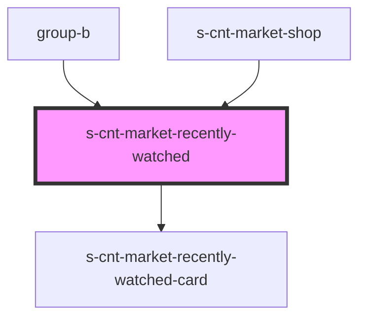

# s-cnt-market-recently-watched

<!-- Auto Generated Below -->

## Properties

| Property                  | Attribute                | Description                                    | Type                                       | Default     |
| ------------------------- | ------------------------ | ---------------------------------------------- | ------------------------------------------ | ----------- |
| `recentlyWatchedProducts` | --                       | Данные карточек слайдера просмотренных товаров | `MarketRecentlyWatchedProductsInterface[]` | `[]`        |
| `recentlyWatchedTitle`    | `recently-watched-title` | Заголовк раздела                               | `string`                                   | `undefined` |

## Events

| Event       | Description                                 | Type                |
| ----------- | ------------------------------------------- | ------------------- |
| `showModal` | Клик по карточке для показа модального окна | `CustomEvent<void>` |

## Dependencies

### Used by

 - [group-b](../../../../../../../group-b)
 - [s-cnt-market-shop](../../..)

### Depends on

- [s-cnt-market-recently-watched-card](./res/view/s-cnt-market-recently-watched-card)

### Graph

----------------------------------------------

*Built with [StencilJS](https://stenciljs.com/)*
