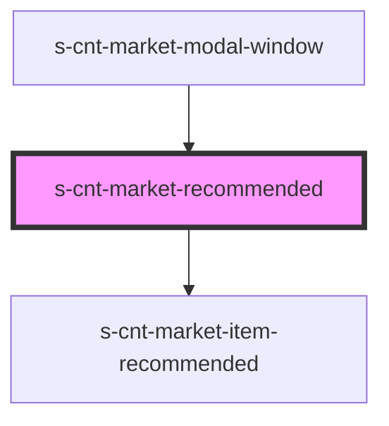

# s-cnt-market-recommended

<!-- Auto Generated Below -->

## Properties

| Property         | Attribute | Description            | Type                           | Default     |
| ---------------- | --------- | ---------------------- | ------------------------------ | ----------- |
| `getRecommended` | --        | Данные для Recommended | `MarketRecommendedInterface[]` | `[]`        |
| `info`           | `info`    |                        | `any`                          | `undefined` |

## Dependencies

### Used by

 - [s-cnt-market-modal-window](../../..)

### Depends on

- [s-cnt-market-item-recommended](./res/view/s-cnt-market-item-recommended)

### Graph

----------------------------------------------

*Built with [StencilJS](https://stenciljs.com/)*
