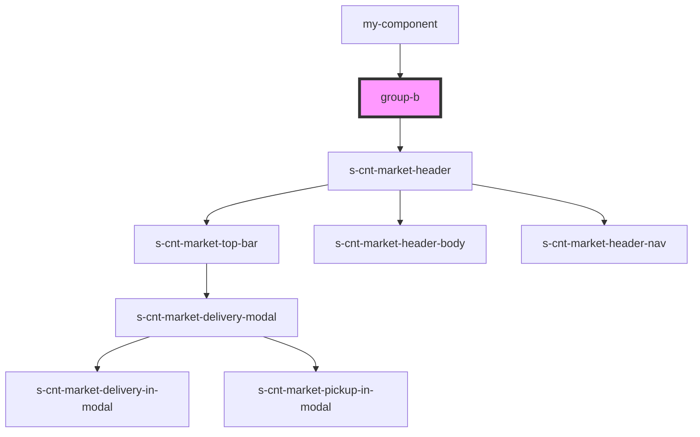

# group-b

<!-- Auto Generated Below -->

## Dependencies

### Used by

 - [my-component](../my-component)

### Depends on

- [s-cnt-market-header](./res/view/s-cnt-market-header)

### Graph

----------------------------------------------

*Built with [StencilJS](https://stenciljs.com/)*
