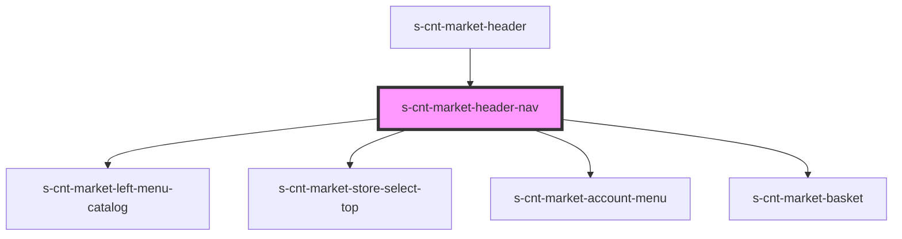

# s-cnt-market-header-nav

<!-- Auto Generated Below -->

## Properties

| Property             | Attribute | Description                      | Type                         | Default     |
| -------------------- | --------- | -------------------------------- | ---------------------------- | ----------- |
| `leftMenuCatalogArr` | --        | Данные для магазинов из каталога | `leftMenuCatalogInterface[]` | `[]`        |
| `login`              | `login`   | Log in user                      | `boolean`                    | `undefined` |
| `navBar`             | --        |                                  | `navBarInterface`            | `undefined` |
| `selectShops`        | --        | магазины для вашего города       | `selectShopsInterface[]`     | `[]`        |

## Dependencies

### Used by

 - [s-cnt-market-header](../../..)

### Depends on

- [s-cnt-market-left-menu-catalog](./res/view/s-cnt-market-left-menu-catalog)
- [s-cnt-market-store-select-top](./res/view/s-cnt-market-store-select-top)
- [s-cnt-market-account-menu](./res/view/s-cnt-market-account-menu)
- [s-cnt-market-basket](./res/view/s-cnt-market-basket)

### Graph

----------------------------------------------

*Built with [StencilJS](https://stenciljs.com/)*
