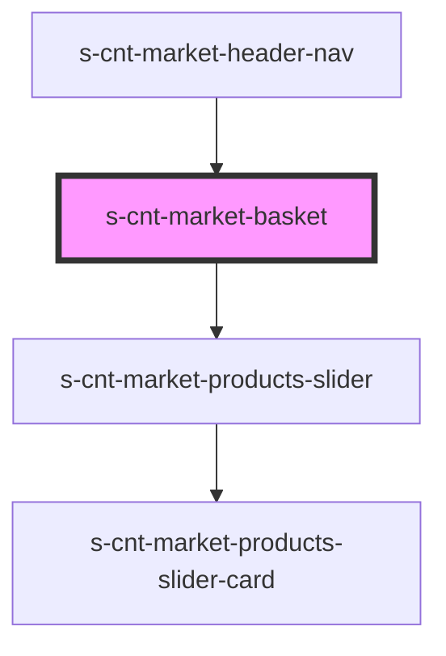

# s-cnt-market-basket

<!-- Auto Generated Below -->

## Properties

| Property             | Attribute       | Description                                | Type                            | Default     |
| -------------------- | --------------- | ------------------------------------------ | ------------------------------- | ----------- |
| `marketCartProducts` | --              | Продукты из корзины                        | `MarketCartProductsInterface[]` | `[]`        |
| `openedBasket`       | `opened-basket` | Стейт на состояние корзины открыто/закрыто | `boolean`                       | `undefined` |

## Events

| Event         | Description      | Type                |
| ------------- | ---------------- | ------------------- |
| `closeBasket` | /Закрыть корзину | `CustomEvent<void>` |

## Dependencies

### Used by

 - [s-cnt-market-header-nav](../../..)

### Depends on

- [s-cnt-market-products-slider](../../../../../../../../../../../../../group-a/res/view/s-cnt-market-shop/res/view/s-cnt-market-products-slider)

### Graph

----------------------------------------------

*Built with [StencilJS](https://stenciljs.com/)*
