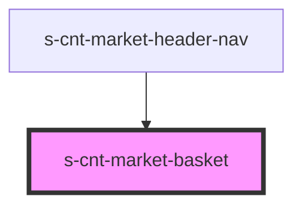

# s-cnt-market-basket

<!-- Auto Generated Below -->

## Properties

| Property       | Attribute       | Description                                | Type      | Default     |
| -------------- | --------------- | ------------------------------------------ | --------- | ----------- |
| `openedBasket` | `opened-basket` | Стейт на состояние корзины открыто/закрыто | `boolean` | `undefined` |

## Events

| Event         | Description      | Type                |
| ------------- | ---------------- | ------------------- |
| `closeBasket` | /Закрыть корзину | `CustomEvent<void>` |

## Dependencies

### Used by

 - [s-cnt-market-header-nav](../../..)

### Graph

----------------------------------------------

*Built with [StencilJS](https://stenciljs.com/)*
