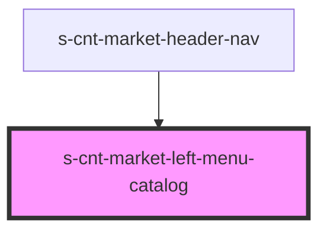

# s-cnt-market-left-menu-catalog

<!-- Auto Generated Below -->

## Properties

| Property             | Attribute          | Description                 | Type                         | Default     |
| -------------------- | ------------------ | --------------------------- | ---------------------------- | ----------- |
| `leftMenuCatalogArr` | --                 | массив магазинов для вывода | `leftMenuCatalogInterface[]` | `[]`        |
| `openedLeftMenu`     | `opened-left-menu` | стейт на состояние меню     | `boolean`                    | `undefined` |

## Events

| Event           | Description    | Type               |
| --------------- | -------------- | ------------------ |
| `closeLeftMenu` | закрывать меню | `CustomEvent<any>` |

## Dependencies

### Used by

 - [s-cnt-market-header-nav](../../..)

### Graph

----------------------------------------------

*Built with [StencilJS](https://stenciljs.com/)*
