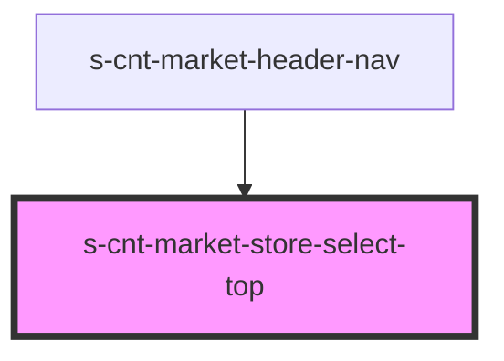

# s-cnt-market-store-select-top

<!-- Auto Generated Below -->

## Properties

| Property            | Attribute             | Description       | Type                           | Default     |
| ------------------- | --------------------- | ----------------- | ------------------------------ | ----------- |
| `openedStoreSelect` | `opened-store-select` | состояние модалки | `boolean`                      | `undefined` |
| `selectShops`       | --                    | selectShops       | `MarketSelectShopsInterface[]` | `undefined` |

## Events

| Event              | Description      | Type               |
| ------------------ | ---------------- | ------------------ |
| `closeStoreSelect` | /Закрыть корзину | `CustomEvent<any>` |

## Dependencies

### Used by

 - [s-cnt-market-header-nav](../../..)

### Graph

----------------------------------------------

*Built with [StencilJS](https://stenciljs.com/)*
