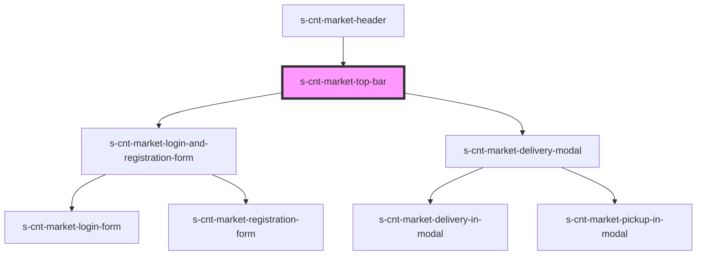

# s-cnt-market-top-bar

<!-- Auto Generated Below -->

## Properties

| Property | Attribute | Description                                               | Type                    | Default     |
| -------- | --------- | --------------------------------------------------------- | ----------------------- | ----------- |
| `topBar` | --        | объект данных для компонента top-bar и его подкомпонентов | `MarketTopBarInterface` | `undefined` |

## Dependencies

### Used by

 - [s-cnt-market-header](../../..)

### Depends on

- [s-cnt-market-login-and-registration-form](./res/view/s-cnt-market-login-and-registration-form)
- [s-cnt-market-delivery-modal](./res/view/s-cnt-market-delivery-modal)

### Graph

----------------------------------------------

*Built with [StencilJS](https://stenciljs.com/)*
