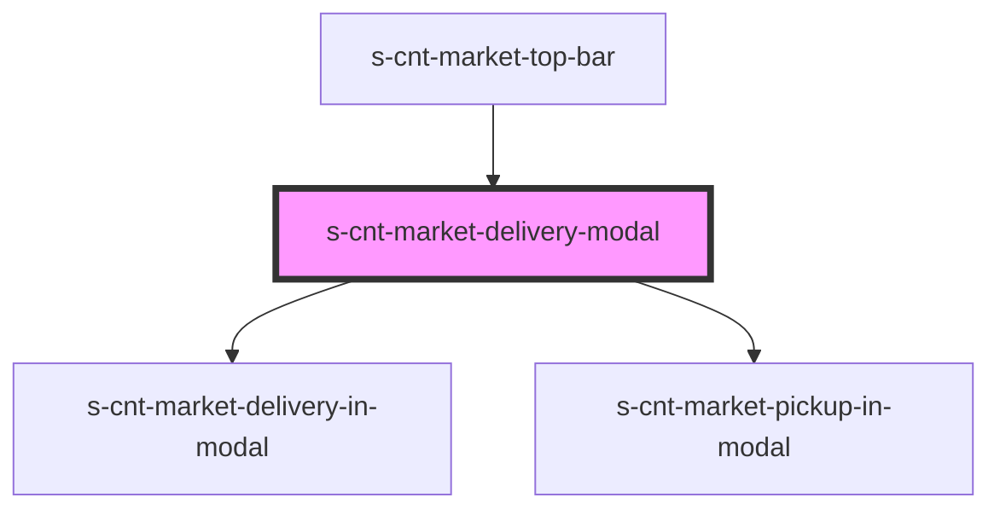

# s-cnt-market-delivery-modal

<!-- Auto Generated Below -->

## Properties

| Property    | Attribute  | Description                                                               | Type                         | Default     |
| ----------- | ---------- | ------------------------------------------------------------------------- | ---------------------------- | ----------- |
| `delivery`  | `delivery` | boolean значение для вывода/закрытия блока доставки и присвоения класса   | `boolean`                    | `undefined` |
| `modalData` | --         | объект из mock для вывода данных в компоненте модального окна             | `MarketTopBarModalInterface` | `undefined` |
| `pickUp`    | `pick-up`  | boolean значение для вывода/закрытия блока самовывоза и присвоения класса | `boolean`                    | `undefined` |

## Events

| Event                | Description                                        | Type               |
| -------------------- | -------------------------------------------------- | ------------------ |
| `closeForm`          | Закрытие модального модального окна выбора адреса  | `CustomEvent<any>` |
| `idSelectionAddress` | функция для смены значения boolean пропса pickUp   | `CustomEvent<any>` |
| `openDelivery`       | функция для смены значения boolean пропса delivery | `CustomEvent<any>` |
| `openLogin`          | Закрытие модального модального окна                | `CustomEvent<any>` |
| `openPickUp`         | функция для смены значения boolean пропса pickUp   | `CustomEvent<any>` |

## Dependencies

### Used by

 - [s-cnt-market-top-bar](../../..)

### Depends on

- [s-cnt-market-delivery-in-modal](./res/view/s-cnt-market-delivery-in-modal)
- [s-cnt-market-pickup-in-modal](./res/view/s-cnt-market-pickUp-in-modal)

### Graph

----------------------------------------------

*Built with [StencilJS](https://stenciljs.com/)*
