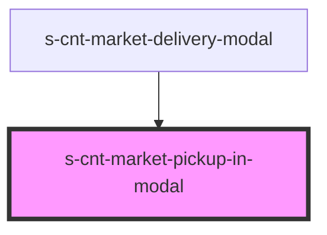

# s-cnt-market-pickup-in-modal

<!-- Auto Generated Below -->

## Properties

| Property     | Attribute | Description                  | Type                               | Default     |
| ------------ | --------- | ---------------------------- | ---------------------------------- | ----------- |
| `pickUpData` | --        | Данные из объекта данных мок | `MarketTopBarModalPickUpInterface` | `undefined` |

## Events

| Event                | Description                                      | Type               |
| -------------------- | ------------------------------------------------ | ------------------ |
| `idSelectionAddress` | функция для смены значения boolean пропса pickUp | `CustomEvent<any>` |

## Dependencies

### Used by

 - [s-cnt-market-delivery-modal](../../..)

### Graph

----------------------------------------------

*Built with [StencilJS](https://stenciljs.com/)*
