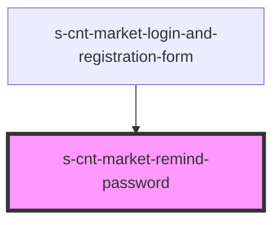

# s-cnt-market-remind-password

<!-- Auto Generated Below -->

## Properties

| Property     | Attribute  | Description                        | Type                            | Default     |
| ------------ | ---------- | ---------------------------------- | ------------------------------- | ----------- |
| `backBtn`    | `back-btn` | boolean значение                   | `boolean`                       | `undefined` |
| `remindPass` | --         | объект данных для компонента входа | `MarketRemindPasswordInterface` | `undefined` |
| `users`      | --         | массив с данными пользователей     | `MarketUsersArrInterface[]`     | `undefined` |

## Events

| Event           | Description                                                 | Type               |
| --------------- | ----------------------------------------------------------- | ------------------ |
| `clickSendMail` |                                                             | `CustomEvent<any>` |
| `closeLogin`    | Закрытие модального модального окна формы входа/регистрации | `CustomEvent<any>` |

## Dependencies

### Used by

 - [s-cnt-market-login-and-registration-form](../../../../../..)

### Graph

----------------------------------------------

*Built with [StencilJS](https://stenciljs.com/)*
