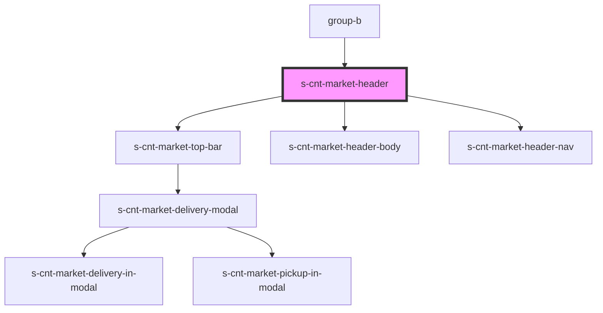

# s-cnt-market-header

<!-- Auto Generated Below -->

## Properties

| Property     | Attribute    | Description              | Type  | Default     |
| ------------ | ------------ | ------------------------ | ----- | ----------- |
| `categories` | `categories` | Массив данных для хедера | `any` | `undefined` |

## Dependencies

### Used by

 - [group-b](../../..)

### Depends on

- [s-cnt-market-top-bar](./res/view/s-cnt-market-top-bar)
- [s-cnt-market-header-body](./res/view/s-cnt-market-header-body)
- [s-cnt-market-header-nav](./res/view/s-cnt-market-header-nav)

### Graph

----------------------------------------------

*Built with [StencilJS](https://stenciljs.com/)*
