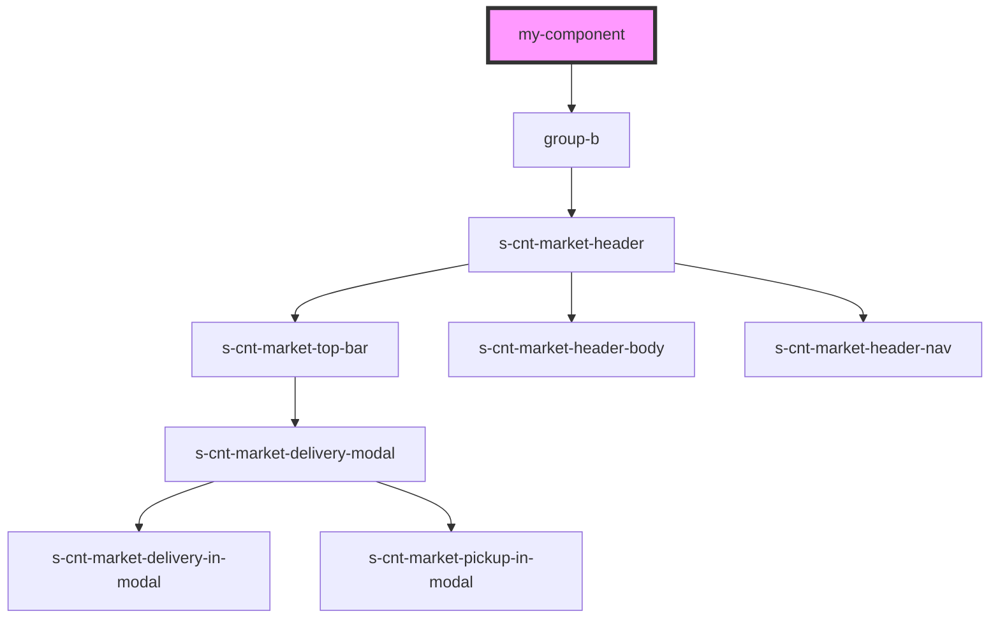

# my-component

<!-- Auto Generated Below -->

## Dependencies

### Depends on

- [group-b](../group-b)

### Graph

----------------------------------------------

*Built with [StencilJS](https://stenciljs.com/)*
