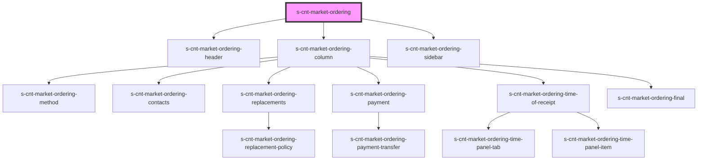

# s-cnt-market-ordering

<!-- Auto Generated Below -->

## Dependencies

### Depends on

- [s-cnt-market-ordering-header](./res/view/s-cnt-market-ordering-header)
- [s-cnt-market-ordering-column](./res/view/s-cnt-market-ordering-column)
- [s-cnt-market-ordering-sidebar](./res/view/s-cnt-market-ordering-sidebar)

### Graph

----------------------------------------------

*Built with [StencilJS](https://stenciljs.com/)*
