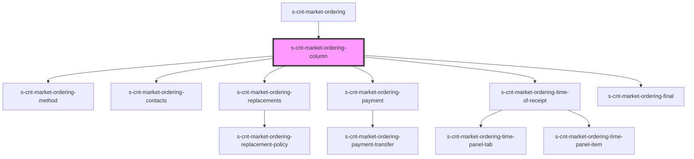

# s-cnt-market-ordering-column

<!-- Auto Generated Below -->

## Properties

| Property   | Attribute  | Description        | Type  | Default     |
| ---------- | ---------- | ------------------ | ----- | ----------- |
| `ordering` | `ordering` | Данные для панелей | `any` | `undefined` |

## Dependencies

### Used by

 - [s-cnt-market-ordering](../../..)

### Depends on

- [s-cnt-market-ordering-method](./res/view/s-cnt-market-ordering-method)
- [s-cnt-market-ordering-contacts](./res/view/s-cnt-market-ordering-contacts)
- [s-cnt-market-ordering-replacements](./res/view/s-cnt-market-ordering-replacements)
- [s-cnt-market-ordering-payment](./res/view/s-cnt-market-ordering-payment)
- [s-cnt-market-ordering-time-of-receipt](./res/view/s-cnt-market-ordering-time-of-receipt)
- [s-cnt-market-ordering-final](./res/view/s-cnt-market-ordering-final)

### Graph

----------------------------------------------

*Built with [StencilJS](https://stenciljs.com/)*
