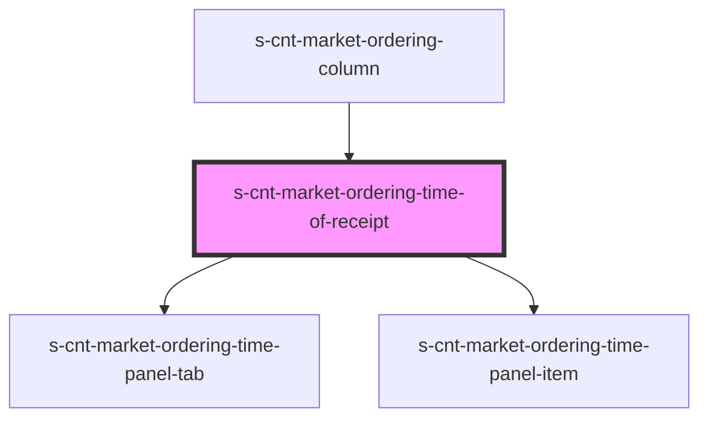

# s-cnt-market-ordering-time-of-receipt

<!-- Auto Generated Below -->

## Properties

| Property                | Attribute                   | Description                          | Type      | Default     |
| ----------------------- | --------------------------- | ------------------------------------ | --------- | ----------- |
| `addOrRemoveClassState` | `add-or-remove-class-state` | Стейт для переключения класса active | `boolean` | `undefined` |
| `timetable`             | `timetable`                 | Данные для панели метод получения    | `any`     | `undefined` |

## Events

| Event               | Description              | Type               |
| ------------------- | ------------------------ | ------------------ |
| `addClassActive`    | Добавление класса active | `CustomEvent<any>` |
| `removeClassActive` | Удаление класса active   | `CustomEvent<any>` |

## Dependencies

### Used by

 - [s-cnt-market-ordering-column](../../..)

### Depends on

- [s-cnt-market-ordering-time-panel-tab](./res/view/s-cnt-market-ordering-time-panel-tab)
- [s-cnt-market-ordering-time-panel-item](./res/view/s-cnt-market-ordering-time-panel-item)

### Graph

----------------------------------------------

*Built with [StencilJS](https://stenciljs.com/)*
