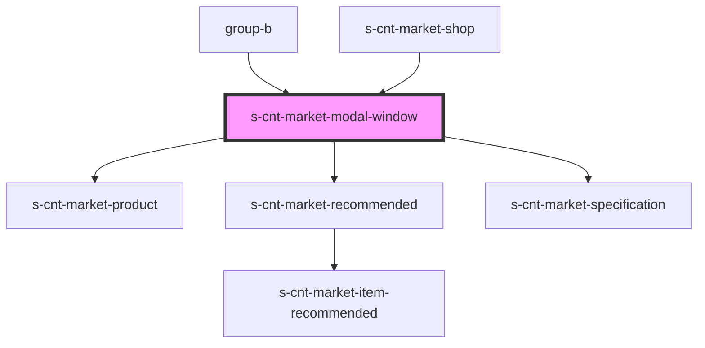

# s-cnt-market-modal-window

<!-- Auto Generated Below -->

## Properties

| Property       | Attribute | Description                | Type                          | Default     |
| -------------- | --------- | -------------------------- | ----------------------------- | ----------- |
| `productModal` | --        | Данные для модального окна | `MarketProductModalInterface` | `undefined` |

## Events

| Event          | Description                             | Type                |
| -------------- | --------------------------------------- | ------------------- |
| `clickOnModal` | Клик по кнопке закрытия модального окна | `CustomEvent<void>` |

## Dependencies

### Used by

 - [group-b](../../group-b)
 - [s-cnt-market-shop](../../group-a/res/view/s-cnt-market-shop)

### Depends on

- [s-cnt-market-product](./res/view/s-cnt-market-product)
- [s-cnt-market-recommended](./res/view/s-cnt-market-recommended)
- [s-cnt-market-specification](./res/view/s-cnt-market-specification)

### Graph

----------------------------------------------

*Built with [StencilJS](https://stenciljs.com/)*
