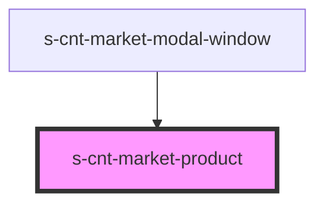

# s-cnt-market-product

<!-- Auto Generated Below -->

## Properties

| Property       | Attribute | Description        | Type                          | Default     |
| -------------- | --------- | ------------------ | ----------------------------- | ----------- |
| `getProduct`   | --        | Данные для Product | `MarketGetProductInterface`   | `undefined` |
| `productBlock` | --        | Данные для Product | `MarketProductBlockInterface` | `undefined` |

## Events

| Event          | Description                             | Type                |
| -------------- | --------------------------------------- | ------------------- |
| `clickOnModal` | Клик по кнопке закрытия модального окна | `CustomEvent<void>` |

## Dependencies

### Used by

 - [s-cnt-market-modal-window](../../..)

### Graph

----------------------------------------------

*Built with [StencilJS](https://stenciljs.com/)*
