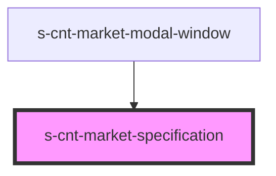

# s-cnt-market-specification

<!-- Auto Generated Below -->

## Properties

| Property             | Attribute | Description              | Type                                | Default     |
| -------------------- | --------- | ------------------------ | ----------------------------------- | ----------- |
| `getSpecification`   | --        | Данные для Specification | `MarketGetSpecificationInterface`   | `undefined` |
| `specificationBlock` | --        | Данные для Specification | `MarketSpecificationBlockInterface` | `undefined` |

## Dependencies

### Used by

 - [s-cnt-market-modal-window](../../..)

### Graph

----------------------------------------------

*Built with [StencilJS](https://stenciljs.com/)*
