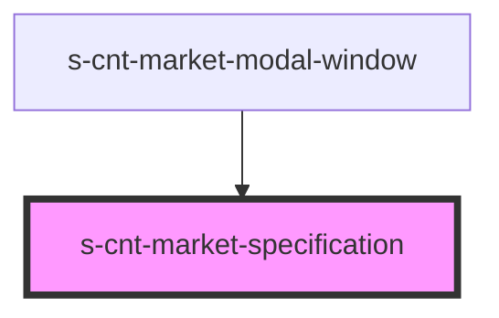

# s-cnt-market-specification

<!-- Auto Generated Below -->

## Properties

| Property                       | Attribute           | Description                 | Type                             | Default     |
| ------------------------------ | ------------------- | --------------------------- | -------------------------------- | ----------- |
| `MarketSpecificationInterface` | --                  | Интерфейс для Specification | `MarketSpecificationInterface[]` | `[]`        |
| `getSpecification`             | `get-specification` | Данные для Specification    | `any`                            | `undefined` |

## Dependencies

### Used by

 - [s-cnt-market-modal-window](../../..)

### Graph

----------------------------------------------

*Built with [StencilJS](https://stenciljs.com/)*
